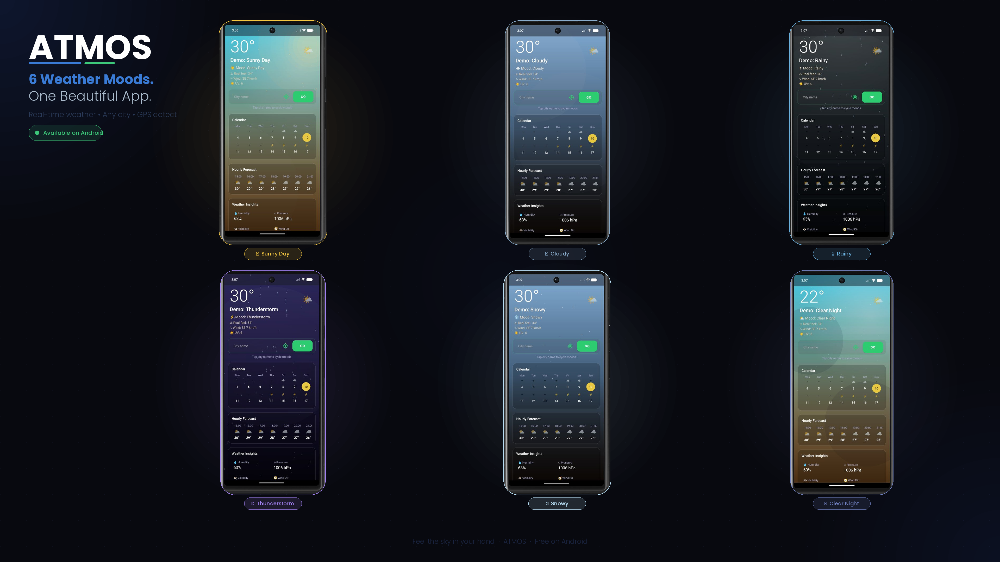
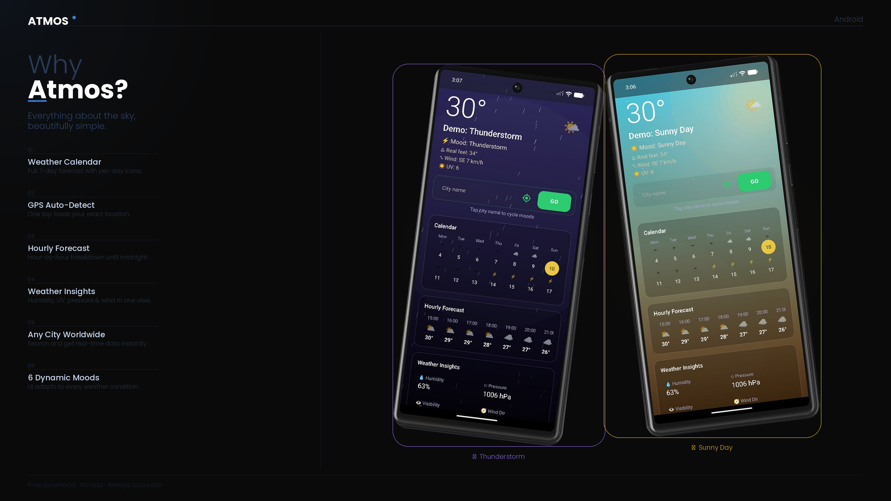

<p align="center">
  
  
</p>

# AlgoMotion

AlgoMotion is a Windows desktop sorting algorithm visualizer written in C++ with the Win32 API and GDI. It animates each step of a sort, highlights active values, shows pseudocode and C++ snippets, and tracks comparisons and writes while the algorithm runs.

## Features

- Visualizes six sorting algorithms:
  - Insertion Sort
  - Selection Sort
  - Merge Sort
  - Bubble Sort
  - Quick Sort
  - Heap Sort
- Custom input for array size and values.
- Play, pause, reset, step, and speed controls.
- Keyboard shortcuts for playback and stepping.
- Per-frame explanation text.
- Comparison and write counters.
- Pseudocode and C++ code panels for the selected algorithm.
- Windows application icon included through the resource file.

## Project Preview

<p align="center">
  
</p>

<p align="center">
  
</p>

## How AlgoMotion Visualizer Works Demo


https://github.com/user-attachments/assets/bcaad555-69de-49f0-9463-43f3b61a41d8


## Project Structure

```text
AlgoMotion/
|-- image/
|   |-- project-preview.png
|   `-- project-preview2.png
|-- video demo/
|   `-- Recording 2026-05-03 183758.mp4
|-- main.cpp
|-- SortingVisualizer.h
|-- SortingVisualizer.cpp
|-- SortingAlgorithms/
|   |-- BubbleSort.cpp
|   |-- HeapSort.cpp
|   |-- InsertionSort.cpp
|   |-- MergeSort.cpp
|   |-- QuickSort.cpp
|   `-- SelectionSort.cpp
|-- app.rc
|-- resource.h
|-- algomotion.ico
|-- AlgoMotion.exe
`-- .vscode/
    `-- settings.json
```

## Requirements

- Windows
- MinGW-w64 or another GCC toolchain that provides:
  - `g++`
  - `windres`
- C++17 support

## Build

From the project root, run:

```powershell
windres app.rc -O coff -o app.res
g++ main.cpp SortingVisualizer.cpp SortingAlgorithms\InsertionSort.cpp SortingAlgorithms\SelectionSort.cpp SortingAlgorithms\MergeSort.cpp SortingAlgorithms\BubbleSort.cpp SortingAlgorithms\QuickSort.cpp SortingAlgorithms\HeapSort.cpp app.res -std=c++17 -Wall -Wextra -mwindows -lgdi32 -lcomctl32 -o AlgoMotion.exe
```

The VS Code Code Runner configuration in `.vscode/settings.json` already contains this build-and-run command.

## Run

After building, start the app with:

```powershell
.\AlgoMotion.exe
```

You can also run the included `AlgoMotion.exe` directly on Windows.

## Usage

1. Select a sorting algorithm from the top row.
2. Enter the array size in the `Size` box.
3. Enter values in the values box, separated by commas or spaces.
4. Press `Play` to animate the sort or `Step` to advance one frame at a time.

Input rules:

- Size must be between `1` and `24`.
- Values must be between `1` and `99`.
- If a size is entered, it must match the number of values.
- Values can be separated with commas, spaces, semicolons, or pipes.

Example:

```text
Size: 5
Values: 8, 4, 12, 6, 1
```

## Keyboard Shortcuts

| Key | Action |
| --- | --- |
| Space | Play or pause |
| Right Arrow | Step forward |
| Left Arrow | Step backward |
| Plus | Increase animation speed |
| Minus | Decrease animation speed |

## Source Overview

- `main.cpp` creates the Win32 window, controls, drawing routines, input validation, timers, and keyboard handling.
- `SortingVisualizer.h` defines the algorithm enum, animation frame data, and visualizer class.
- `SortingVisualizer.cpp` manages shared animation frame state.
- `SortingAlgorithms/*.cpp` contains the frame-building logic for each sorting algorithm.
- `app.rc` and `resource.h` attach the application icon.

## Developer

Developed by Pranto Ahmed.

Contact: farhinahmed71@gmail.com
