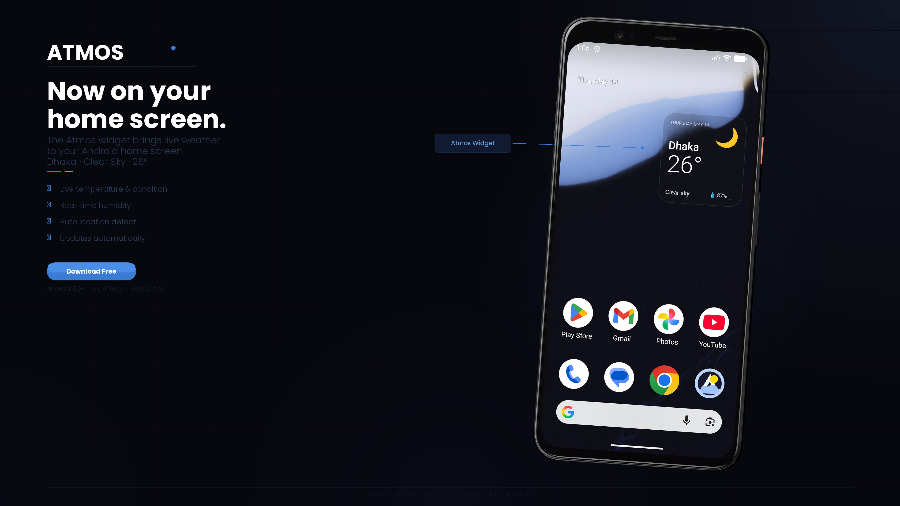

 

# 🌤️ Atmos

### A dark, animated weather app for Android

 

 

 

---

 

---

## ✨ Features

| | Feature | Description |
|---|---|---|
| 🌑 | **Dark UI** | 6 dynamic weather moods that shift with conditions |
| 📡 | **Live Weather** | Real-time data via [Open-Meteo](https://open-meteo.com) — free, no key |
| 📍 | **GPS Detect** | Auto-loads your location on launch |
| 🔍 | **City Search** | Search any city worldwide |
| 📅 | **14-Day Calendar** | Full forecast calendar view |
| ⛈️ | **Animations** | Rain, snow, sun, clouds, thunderstorm effects |
| 🏠 | **Home Screen Widget** | View current weather at a glance without opening the app |
| 📱 | **Compatibility** | Android 8.0+ (API 26+) |

---

##  ⭐ Application 

    --version_1
- Go to Releases "Atmos v1.0.0" 
- Download the "AtmosINS.apk"

    --version_2
- Go to Releases "Atmos v2.0.0" 
- Download the "AtmosINSv2.apk"

---

## 📝 Notes

- First launch will request **location permission**
- If denied → type any city name and tap **Go**

---
